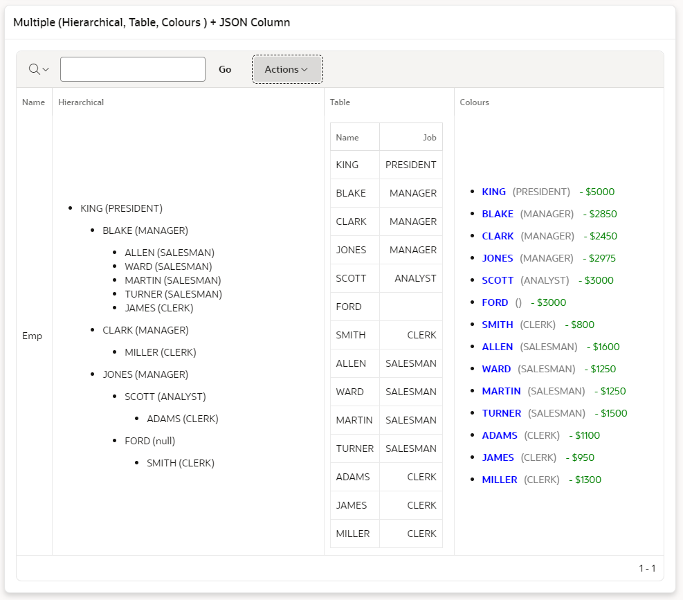
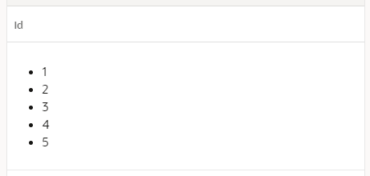
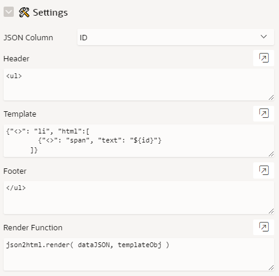
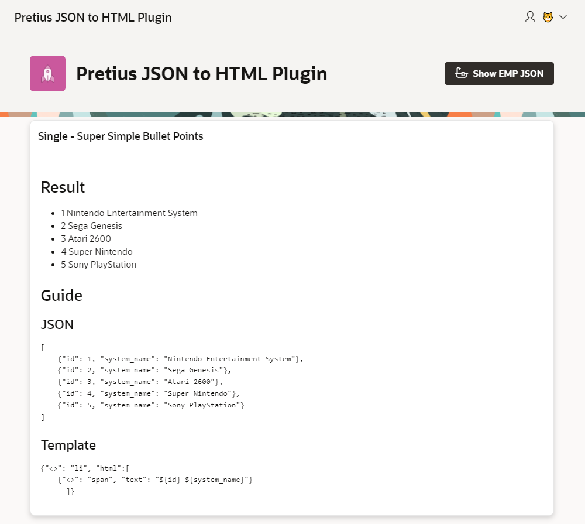
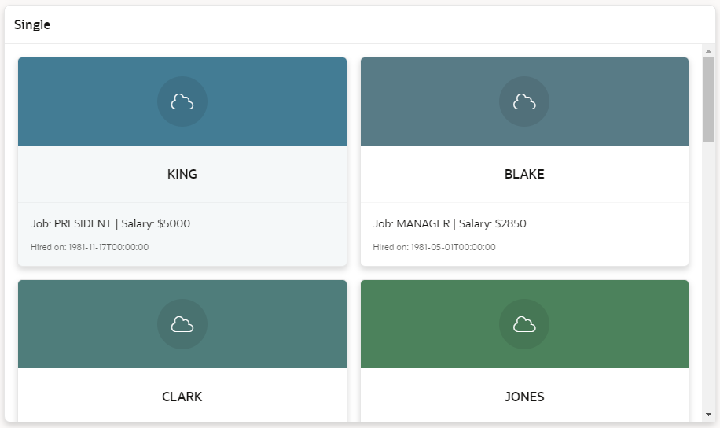

<h1> Pretius JSON to HTML Plugin </h1>

  

- [What is the Pretius JSON to HTML Plugin](#what-is-the-pretius-json-to-html-plugin)
- [Release History](#release-history)
- [Installation](#installation)
- [Basic IR Usage](#basic-ir-usage)
- [Settings](#settings)
- [Demo Application](#demo-application)
- [License](#license)
- [Free Support](#free-support)
- [Bug Reporting and Change Requests](#bug-reporting-and-change-requests)
- [Implementation Issues](#implementation-issues)
- [Become a Contributor](#become-a-contributor)
- [Commercial Support](#commercial-support)


## What is the Pretius JSON to HTML Plugin

The Pretius JSON to HTML Plugin is an Oracle APEX Template Component plugin developed by [Matt Mulvaney](https://twitter.com/Matt_Mulvaney) at <a href="https://www.pretius.com" title="https://www.pretius.com">Pretius</a>. 

This Plugin takes a JSON, combines it with a Template Object and allows the Developer to create some mad designs. 

For example, taking this JSON
   ```
   [{"empno":7839,"ename":"KING","job":"PRESIDENT","mgr":null,"hiredate":"1981-11-17T00:00:00","sal":5000,"comm":null,"deptno":10},{"empno":7698,"ename":"BLAKE","job":"MANAGER","mgr":7839,"hiredate":"1981-05-01T00:00:00","sal":2850,"comm":null,"deptno":30},{"empno":7782,"ename":"CLARK","job":"MANAGER","mgr":7839,"hiredate":"2024-08-30T10:30:00","sal":2450,"comm":null,"deptno":10},{"empno":7566,"ename":"JONES","job":"MANAGER","mgr":7839,"hiredate":"1981-04-02T00:00:00","sal":2975,"comm":null,"deptno":20},{"empno":7788,"ename":"SCOTT","job":"ANALYST","mgr":7566,"hiredate":"1982-12-09T00:00:00","sal":3000,"comm":null,"deptno":20},{"empno":7902,"ename":"FORD","job":"ANALYST","mgr":7566,"hiredate":"1981-12-03T00:00:00","sal":3000,"comm":null,"deptno":20},{"empno":7369,"ename":"SMITH","job":"CLERK","mgr":7902,"hiredate":"1980-12-17T00:00:00","sal":800,"comm":null,"deptno":20},{"empno":7499,"ename":"ALLEN","job":"SALESMAN","mgr":7698,"hiredate":"1981-02-20T00:00:00","sal":1600,"comm":300,"deptno":30},{"empno":7521,"ename":"WARD","job":"SALESMAN","mgr":7698,"hiredate":"1981-02-22T00:00:00","sal":1250,"comm":500,"deptno":30},{"empno":7654,"ename":"MARTIN","job":"SALESMAN","mgr":7698,"hiredate":"1981-09-28T00:00:00","sal":1250,"comm":1400,"deptno":30},{"empno":7844,"ename":"TURNER","job":"SALESMAN","mgr":7698,"hiredate":"1981-09-08T00:00:00","sal":1500,"comm":0,"deptno":30},{"empno":7876,"ename":"ADAMS","job":"CLERK","mgr":7788,"hiredate":"1983-01-12T00:00:00","sal":1100,"comm":null,"deptno":20},{"empno":7900,"ename":"JAMES","job":"CLERK","mgr":7698,"hiredate":"1981-12-03T00:00:00","sal":950,"comm":null,"deptno":30},{"empno":7934,"ename":"MILLER","job":"CLERK","mgr":7782,"hiredate":"1982-01-23T00:00:00","sal":1300,"comm":null,"deptno":10}]
   ```

... we can apply 3 different templates to produce the following HTML




## Release History
24.1.1
 - Initial version

## Installation
1. Download the plug-in file from the latest release
2. Import the plug-in file into your application

## Basic IR Usage

This example will create a bullet point list

1. Create a IR with this SQL
   ```
   SELECT '[
    {"id": 1},
    {"id": 2},
    {"id": 3},
    {"id": 4},
    {"id": 5}
   ]' AS id
   FROM dual
    ```
2. Change the ID Column to Type **Pretius JSON to HTML**
3. In the Plugin Setttings, change the Column to **ID**
4. Keep all the Plugin settings as default
5. Run the Page

This should produce the following Interactive Report

 


## Settings



| Name                  | Value                                                                                   |
|-----------------------|-----------------------------------------------------------------------------------------|
| JSON Column           | Column from the SQL containing the JSON                                                 |
| Header                | HTML to add at the start of the converted JSON                                          |
| Template              | Template in json2html format https://www.json2html.com/docs/                           |
| Footer                | HTML to add at the end of the converted JSON                                            |
| Render Function       | For advanced users to call specific templates or for transforming the data object       |


## Demo Application
You can find a Demo Application [here](https://apex.oracle.com/pls/apex/r/luf/jsontohtml-plugin).
 


You can download the the Demo Application [here](app/f231.sql).

## Templates

<details>
  <summary>Bullets Template</summary>

**JSON**
````
[
    {"id": 1 },
    {"id": 2 }
]
````
Header
````
<ul>
````
Template
```` 
{"<>": "li", "html":[
	{"<>": "span", "text": "${id}"}
 ]}
````
Footer
````
</ul>
````
</details>

<details>
  <summary>Table Template</summary>

**JSON**
````
[
    {"id": 1, "name": "one" },
    {"id": 2, "name": "two" }
]
````
**Header**
````
<table class="t-Report-report">
    <thead>
        <tr>
            <th class="t-Report-colHead mnw60" align="center" id="ID">ID</th>
            <th class="t-Report-colHead mnw300" align="left" id="NAME">Name</th>
        </tr>
    </thead>
````
**Template**
```` 
{
    "<>": "tr",
    "html": [
      { "<>": "td class='t-Report-cell' align='center' headers='ID'", "text": "${id}" },
      { "<>": "td class='t-Report-cell' align='left' headers='NAME'", "text": "${name}" }
    ]
}
````
**Footer**
````
</<table>
````
</details>

<details>
  <summary>Cards Template</summary>

**JSON**
````
with data as (
SELECT  
   'Emp' NAME,
    (SELECT JSON_ARRAYAGG(
             JSON_OBJECT(
               'empno' VALUE empno,
               'ename' VALUE ename,
               'job' VALUE job,
               'mgr' VALUE mgr,
               'hiredate' VALUE hiredate,
               'sal' VALUE sal,
               'comm' VALUE comm,
               'deptno' VALUE deptno
             )
           ) AS employees
    FROM EMP
    ) val
from dual)
SELECT val
  FROM data
````
**Header**
````
<ul class="t-Cards dm-TemplateOption-previewTarget  u-colors t-Cards--displaySubtitle t-Cards--featured t-Cards--block force-fa-lg t-Cards--displayIcons t-Cards--cols t-Cards--desc-2ln t-Cards--animColorFill">
````
**Template**
```` 
{
        "<>": "li",
        "class": "t-Cards-item",
        "html": [
            {
                "<>": "div",
                "class": "t-Card",
                "html": [
                    {
                        "<>": "a",
                        "href": "#",
                        "class": "t-Card-wrap",
                        "html": [
                            {
                                "<>": "div",
                                "class": "t-Card-icon u-color",
                                "html": [
                                    {
                                        "<>": "span",
                                        "class": "t-Icon fa fa-cloud",
                                        "html": [
                                            {
                                                "<>": "span",
                                                "class": "t-Card-initials",
                                                "role": "presentation",
                                                "html": "${ename[0]}"  // Initial of employee name
                                            }
                                        ]
                                    }
                                ]
                            },
                            {
                                "<>": "div",
                                "class": "t-Card-titleWrap",
                                "html": [
                                    {
                                        "<>": "h3",
                                        "class": "t-Card-title",
                                        "html": "${ename}"
                                    },
                                    {
                                        "<>": "h4",
                                        "class": "t-Card-subtitle",
                                        "html": "${location}"
                                    }
                                ]
                            },
                            {
                                "<>": "div",
                                "class": "t-Card-body",
                                "html": [
                                    {
                                        "<>": "div",
                                        "class": "t-Card-desc",
                                        "html": "Job: ${job} | Salary: $${sal}"
                                    },
                                    {
                                        "<>": "div",
                                        "class": "t-Card-info",
                                        "html": "Hired on: ${hiredate}"
                                    }
                                ]
                            },
                            {
                                "<>": "span",
                                "class": "t-Card-colorFill u-color",
                                "aria-hidden": "true"
                            }
                        ]
                    }
                ]
            }
        ]
    }
````
**Footer**
````
</ul>
````
</details>

<details>
  <summary>Hierarchical Template</summary>
  Check the Application
</details>


## Advanced Templates
Please review the Demo Application for more advanced Templates or Review the Documentation at https://www.json2html.com/docs/   

**Top Tip:** Given example documentation, ChatGPT is very good at producing json2html Templates.

## Example Cards using a Single


## License

Licensed under the [MIT](LICENSE) license.

This project incorporates code from the following open-source project:

- Project json2html: https://github.com/moappi/json2html
  License: MIT License (full text available at the link above)


## Free support
Pretius provides free support for the plugins at the GitHub platform. 
We monitor raised issues, prepare fixes, and answer your questions. However, please note that we deliver the plug-ins free of charge, and therefore we will not always be able to help you immediately. 

Interested in better support? 
* [Become a contributor!](#become-a-contributor) We always prioritize the issues raised by our contributors and fix them for free.
* [Consider comercial support.](#commercial-support) Options and benefits are described in the chapter below.

### Bug reporting and change requests
Have you found a bug or have an idea of additional features that the plugin could cover? Firstly, please check the Roadmap and Known issues sections. If your case is not on the lists, please open an issue on a GitHub page following these rules:
* issue should contain login credentials to the application at apex.oracle.com where the problem is reproduced;
* issue should include steps to reproduce the case in the demo application;
* issue should contain description about its nature.

### Implementation issues
If you encounter a problem during the plug-in implementation, please check out our demo application. We do our best to describe each possible use case precisely. If you can not find a solution or your problem is different, contact us: apex-plugins@pretius.com.

## Become a contributor!
We consider our plugins as genuine open source products, and we encourage you to become a contributor. Help us improve plugins by fixing bugs and developing extra features. Comment one of the opened issues or register a new one, to let others know what you are working on. When you finish, create a new pull request. We will review your code and add the changes to the repository.

By contributing to this repository, you help to build a strong APEX community. We will prioritize any issues raised by you in this and any other plugins.

## Commercial support
We are happy to share our experience for free, but we also realize that sometimes response time, quick implementation, SLA, and instant release for the latest version are crucial. That’s why if you need extended support for our plug-ins, please contact us at apex-plugins@pretius.com.
We offer:
* enterprise-level assistance;
* support in plug-ins implementation and utilization;
* dedicated contact channel to our developers;
* SLA at the level your organization require;
* priority update to next APEX releases and features listed in the roadmap.

